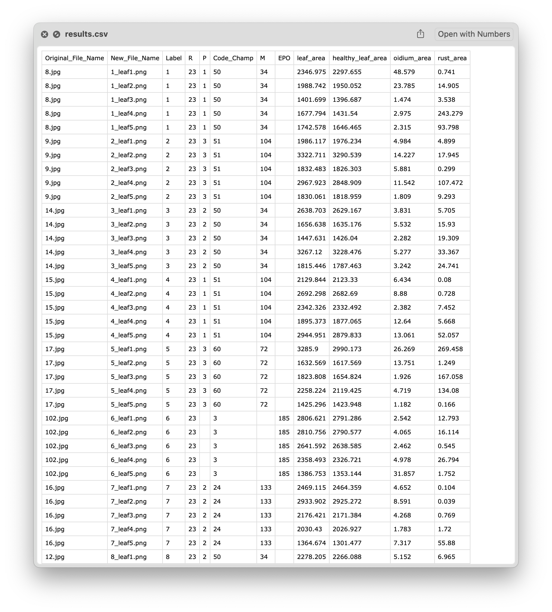
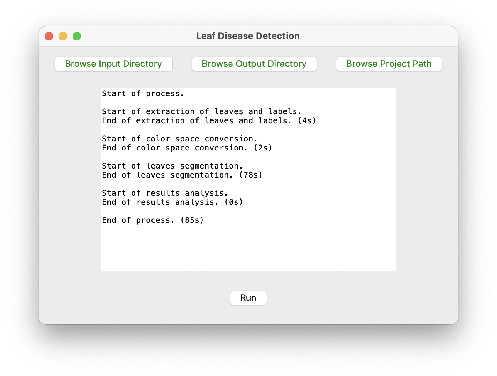

<!----------------------------------------------------------------------->
<a name="readme-top"></a>
<!----------------------------------------------------------------------->

<table width="100%" style="border: none;">
  <tr>
    <!-- <td align="left" style="border: none;"><b>LE GOURRIEREC Titouan</b></td> -->
    <td align="right" style="border: none;">
      <a href="https://www.linkedin.com/in/titouanlegourrierec"></a>
      <a href="mailto:titouanlegourrierec@icloud.com"></a>
      <!-- <a href="https://titouanlegourrierec.github.io"></a> -->
    </td>
  </tr>
</table>

<!----------------------------------------------------------------------->
<!----------------------------------------------------------------------->

<!-- PROJECT LOGO -->
<br />
<div align="center">
  <!-- <a href="https://github.com/othneildrew/Best-README-Template">
    
  </a> -->

  <h3 align="center">Detection and Segmentation of Diseases on wheat leaves </h3>

  <p align="center">
    A tool to segment foliar diseases like powdery mildew or yellow rust on wheat leaves <br /><br /> LE GOURRIEREC Titouan <br /> CONNESSON Léna <br /> PROUVOST Axel<br />
    <!-- <br />
    <a href="https://github.com/othneildrew/Best-README-Template"><strong>Explore the docs »</strong></a>
    <br /> -->
    <br />
    <!-- <a href="https://github.com/othneildrew/Best-README-Template">View Demo</a>
    ·
    <a href="https://github.com/othneildrew/Best-README-Template/issues/new?labels=bug&template=bug-report---.md">Report Bug</a>
    · -->
    <a href="https://github.com/titouanlegourrierec/Leaf_Disease_Segmentation/issues/new">Report a bug · Request Feature</a>
  </p>
</div>


<!-- TABLE OF CONTENTS -->
<details>
  <summary>Table of Contents</summary>
  <ol>
    <li>
      <a href="#-about-the-project-📖">About The Project 📖</a>
      <ul>
        <li><a href="#-built-with-️🛠️">Built With 🛠️</a></li>
      </ul>
    </li>
    <li>
      <a href="#getting-started">Getting Started</a>
      <ul>
        <li><a href="#prerequisites">Prerequisites</a></li>
        <li><a href="#installation">Installation</a></li>
      </ul>
    </li>
    <li><a href="#usage">Usage</a></li>
    <li><a href="#roadmap">Roadmap</a></li>
    <li><a href="#contributing">Contributing</a></li>
    <li><a href="#license">License</a></li>
    <li><a href="#contact">Contact</a></li>
    <li><a href="#acknowledgments">Acknowledgments</a></li>
  </ol>
</details>

<!----------------------------------------------------------------------->
<!----------------------------------------------------------------------->

## About The Project 📖

<p align="center">
  
</p>

This project involves the development of a tool and a machine learning model for the detection and segmentation of foliar diseases such as [powdery mildew](https://en.wikipedia.org/wiki/Powdery_mildew) or [rust](https://en.wikipedia.org/wiki/Wheat_leaf_rust) on wheat leaves. **Ultimately, this tool is used to compare phenotypic blends of wheat to determine the ideal mixture for increasing yields while reducing pesticide usage.**

By employing a random forest algorithm for pixel classification, we demonstrate an accuracy of 99% on isolated disease patches, with average error rates of 14% for rust and 5% for powdery mildew, indicative of minor actual surface errors. Though performance on real leaf samples, characterized by more nuanced textures, is modest, it is enhanced through outlier exclusion, achieving practical accuracies of 62% for rust and 52% for powdery mildew. This study highlights the potential of AI-driven high-throughput methods in mitigating pesticide use through improved understanding and management of crop diseases.

Once executed, the code generates a directory containing the leaves extracted from the original image, along with their segmented versions. Additionally, it produces a CSV file containing information about the labels and areas of each disease, as well as the leaves.

<p align="center">
  
</p>

<!----------------------------------------------------------------------->
<p align="right">(<a href="#readme-top">back to top</a>)</p>
<!----------------------------------------------------------------------->


### Built With 🛠️
* [![Python][Python-badge]][Python-url]
* [![OpenCV][OpenCV-badge]][OpenCV-url]
* ![Shell Script][ShellScript-badge]


<!----------------------------------------------------------------------->
<p align="right">(<a href="#readme-top">back to top</a>)</p>
<!----------------------------------------------------------------------->

## Getting Started 🎬
### Prerequisites 

* Ilastik software: To utilize this code, please download the Ilastik software tailored to your computer's operating system from: https://www.ilastik.org/download.

* Trained model: Additionally, you'll need to download a trained model from this [Google Drive link](https://drive.google.com/drive/folders/1onnnMpm90fbD1AaYEKAe_gVkTO8Fz5mB?usp=sharing). There are four models available, each corresponding to different color spaces. We recommend downloading the **LAB.ilp model** for optimal performance.

### Installation 

1. Clone the repository

```bash
git clone https://github.com/titouanlegourrierec/Leaf_Disease_Segmentation.git
```

2. Create a python virtual environment
```bash
python -m venv env
```

3. Activate your virtual environment
    * For Windows :
     ```bash
    env\Scripts\activate
    ```
    * For  MacOS & Linux  :
    ```bash
    source env/bin/activate
    ```

4. Install the required dependencies from the requirements.txt file
```bash
pip install -r requirements.txt
```


<!----------------------------------------------------------------------->
<p align="right">(<a href="#readme-top">back to top</a>)</p>
<!----------------------------------------------------------------------->


## Usage 👨‍💻

To use this project, you have two options:

1. **GUI Interface**: Utilize it through the graphical user interface.
```bash
env/bin/python segmenter.py
```
Here, you have an interface where you can choose the input directory containing images to process, the directory where processed images will be saved, and the path to the model you want to use. Then, click on the "run" button and wait for the result.

<p align="center">
  
</p>

2. **Terminal Command**: Use it via command line in the terminal.
```bash
env/bin/python segmenter.py -i path/to/input/directory -o path/to/output/directory -p /path/to/trained/model
```


<!----------------------------------------------------------------------->
<p align="right">(<a href="#readme-top">back to top</a>)</p>
<!----------------------------------------------------------------------->


<!-- ROADMAP -->
<!-- ## Roadmap

- [x] Add Changelog
- [x] Add back to top links
- [ ] Add Additional Templates w/ Examples
- [ ] Add "components" document to easily copy & paste sections of the readme
- [ ] Multi-language Support
    - [ ] Chinese
    - [ ] Spanish

See the [open issues](https://github.com/othneildrew/Best-README-Template/issues) for a full list of proposed features (and known issues).

<p align="right">(<a href="#readme-top">back to top</a>)</p> -->


<!-- CONTRIBUTING -->
<!-- ## Contributing

Contributions are what make the open source community such an amazing place to learn, inspire, and create. Any contributions you make are **greatly appreciated**.

If you have a suggestion that would make this better, please fork the repo and create a pull request. You can also simply open an issue with the tag "enhancement".
Don't forget to give the project a star! Thanks again!

1. Fork the Project
2. Create your Feature Branch (`git checkout -b feature/AmazingFeature`)
3. Commit your Changes (`git commit -m 'Add some AmazingFeature'`)
4. Push to the Branch (`git push origin feature/AmazingFeature`)
5. Open a Pull Request

<p align="right">(<a href="#readme-top">back to top</a>)</p> -->


## License 📄

Distributed under the GNU License. See [`LICENSE`](https://github.com/titouanlegourrierec/Leaf_Disease_Segmentation/blob/main/LICENCE) for more information.

<!----------------------------------------------------------------------->
<p align="right">(<a href="#readme-top">back to top</a>)</p>
<!----------------------------------------------------------------------->

## Contact ✉️

LE GOURRIEREC Titouan - [titouanlegourrierec@icloud.com](mailto:titouanlegourrierec@icloud.com)

Project Link: [https://github.com/titouanlegourrierec/Leaf_Disease_Segmentation](https://github.com/titouanlegourrierec/Leaf_Disease_Segmentation)


<!----------------------------------------------------------------------->
<p align="right">(<a href="#readme-top">back to top</a>)</p>
<!----------------------------------------------------------------------->


## Acknowledgments 🙏

* [Ilastik Software](https://www.ilastik.org) : An interactive interface to annotate images to segment.
* [EasIlastik package](https://github.com/titouanlegourrierec/EasIlastik) : A package to facilitate the use of trained model on Ilastik for image segmentation.

<!----------------------------------------------------------------------->
<p align="right">(<a href="#readme-top">back to top</a>)</p>
<!----------------------------------------------------------------------->


<!-- MARKDOWN LINKS & IMAGES -->


[Python-badge]: https://img.shields.io/badge/python-3670A0?style=for-the-badge&logo=python&logoColor=ffdd54
[Python-url]: https://www.python.org

[OpenCV-badge]: https://img.shields.io/badge/opencv-%23white.svg?style=for-the-badge&logo=opencv&logoColor=white
[OpenCV-url]: https://opencv.org

[ShellScript-badge]: https://img.shields.io/badge/shell_script-%23121011.svg?style=for-the-badge&logo=gnu-bash&logoColor=white